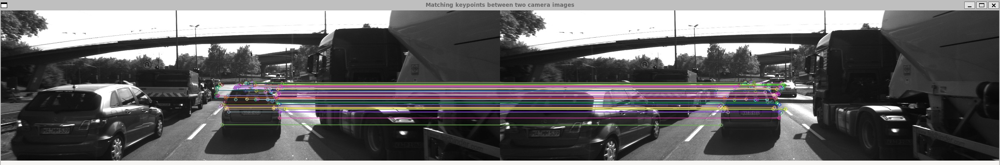

# SFND 2D Feature Tracking




The idea of the camera course is to build a collision detection system - that's the overall goal for the Final Project. As a preparation for this, you will now build the feature tracking part and test various detector / descriptor combinations to see which ones perform best. This mid-term project consists of four parts:
* setting up data structures and putting everything into a ring buffer to optimize memory load
* integrate several keypoint detectors such as HARRIS, FAST, BRISK and SIFT and compare them with regard to number of keypoints and speed
* descriptor extraction and matching using brute force and also the FLANN approach
* test the various algorithms in different combinations and compare them with regard to some performance measures

## Dependencies for Running Locally

#### Compiler
- C++ Standard: C++17
- Compiler: GCC >= 9 (or Clang >= 10)
- CMake >= 3.10

#### Libraries
- OpenCV >= 4.1 (built **locally with opencv_contrib** modules)

#### Notes
- OpenCV must be built from source with `opencv_contrib` modules enabled.
- Make sure `OpenCV_DIR` is properly set in the environment or passed to CMake during configuration.

#### Build Instructions
- Clone repository locally
```bash
# Set up and build
mkdir build && cd build
cmake ..
make
```

## 2D Feature Tracking Performance Report

This report summarizes the performance of various keypoint detector and descriptor combinations used in the project **2D Feature Tracking**. The results are derived from running each detector-descriptor pair across 10 sequential camera frames using the KITTI dataset.

---

### Project Overview

The pipeline evaluates combinations of feature detectors and descriptors for tracking keypoints on a preceding vehicle. Metrics include:

* Average number of keypoints detected (total and inside vehicle ROI)
* Average keypoint neighborhood size
* Total matched keypoints across frames
* Average time for detection and description

---

### Tasks Details

| Task | Description                         | Implementation Details                                                                                             | Implemented |
| ---- | ----------------------------------- | ------------------------------------------------------------------------------------------------------------------ | ----------- |
| MP.1 | Ring buffer for image frames        | Used a vector `dataBuffer` with a fixed size (2). On each frame load, oldest frame is removed if buffer is full.   | ✅           |
| MP.2 | Multiple detectors                  | Enabled via `detKeypointsShiTomasi`, `detKeypointsHarris`, and `detKeypointsModern` using a string-based selector. | ✅           |
| MP.3 | Filter keypoints inside vehicle ROI | Filtered keypoints based on a hard-coded rectangle. Total and ROI keypoints were counted separately.               | ✅           |
| MP.4 | Multiple descriptors                | Used `descKeypoints` function with a descriptor factory pattern to select from BRIEF, ORB, FREAK, etc.             | ✅           |
| MP.5 | BF matcher                          | Used `BFMatcher` with Hamming or L2 norm depending on descriptor type.                                             | ✅           |
| MP.6 | KNN matching + Ratio Test           | `knnMatch()` with k=2 followed by Lowe's ratio test (threshold = 0.8).                                             | ✅           |
| MP.7 | Count keypoints on ROI              | Counted and logged ROI keypoints separately; summed neighborhood size for ROI.                                     | ✅           |
| MP.8 | Count matched keypoints             | Summed total number of matches returned after ratio test.                                                          | ✅           |
| MP.9 | Log timing data to CSV              | Detection and description times logged using a `Logger` class to a single CSV file.                                | ✅           |

---

### Summary Results Table

#### MP.7 – Keypoint Detection (Total and ROI)

| Detector  | Avg KPs (All) | Avg KPs (ROI) | Detection Time (ms) |
| --------- | ------------- | ------------- | ------------------- |
| SHITOMASI | 1342.3        | 117.9         | 8.03                |
| FAST      | 4920.4        | 409.4         | 1.22–1.76           |
| BRISK     | 2711.6        | 271.3         | 43.69–47.92         |
| SIFT      | 1386.1        | 137.1         | 50.87               |


---

#### MP.8 – Matched Keypoints

| Detector  | Descriptor | Matched Keypoints |
| --------- | ---------- | ----------------- |
| SHITOMASI | BRIEF      | 94                |
| SHITOMASI | SIFT       | 92                |
| FAST      | BRIEF      | 285               |
| FAST      | ORB        | 278               |
| FAST      | SIFT       | 278               |
| BRISK     | BRIEF      | 169               |
| BRISK     | SIFT       | 161               |
| SIFT      | SIFT       | 79                |


#### MP.9 – Timing Performance

| Detector  | Descriptor | Detection Time (ms) | Description Time (ms) |
| --------- | ---------- | ------------------- | --------------------- |
| SHITOMASI | BRIEF      | 8.03                | 0.57                  |
| SHITOMASI | SIFT       | 8.96                | 11.46                 |
| FAST      | BRIEF      | 1.76                | 1.25                  |
| FAST      | ORB        | 1.33                | 0.87                  |
| FAST      | SIFT       | 1.22                | 18.85                 |
| BRISK     | BRIEF      | 47.92               | 0.53                  |
| BRISK     | SIFT       | 43.69               | 21.53                 |
| SIFT      | SIFT       | 50.87               | 29.88                 |


* **FAST** produced the highest number of keypoints and matches.
* **BRIEF** descriptor was fastest (≈ 0.5–1 ms).
* **SIFT** provided solid matches but was computationally expensive.
* **ORB** was fast and had good match quality.
* **HARRIS** produced the fewest keypoints.

---

### 🌟 Top 3 Combinations (Performance + Speed)

| Rank | Detector + Descriptor | Reason                             |
| ---- | --------------------- | ---------------------------------- |
| 🥇 1 | FAST + BRIEF          | Fastest with highest match count   |
| 🥈 2 | FAST + ORB            | Great balance of speed and quality |
| 🥉 3 | SHITOMASI + BRIEF     | High match rate, good ROI focus    |

---

### Reproducibility

1. Run the executable
2. Enter detector and descriptor interactively
3. Wait for 10 images to process
4. Summary logged to `performance_summary.csv`

---
