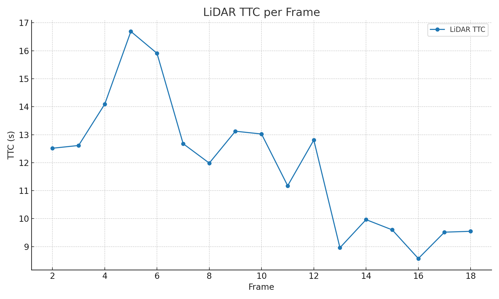
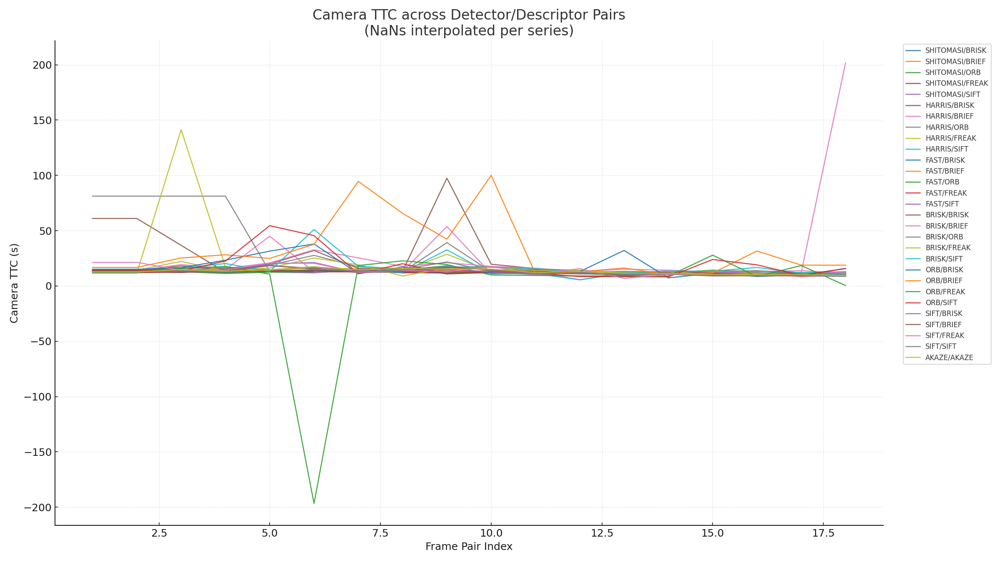
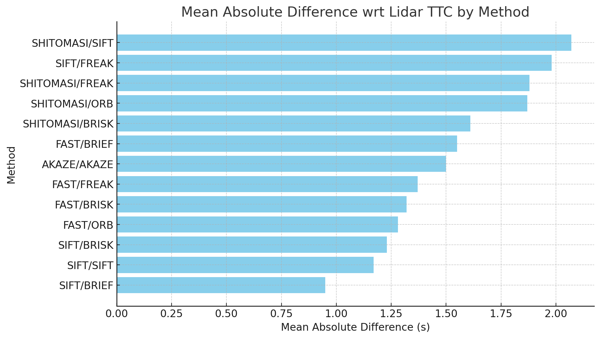
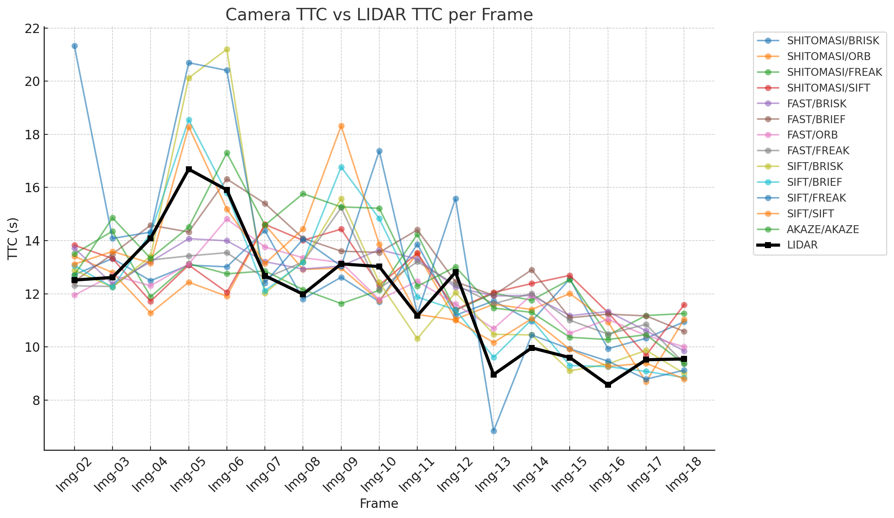
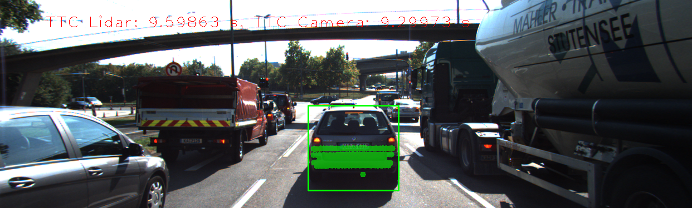

# 3D Object Tracking Project - Udacity Sensor Fusion Nanodegree

This project implements **3D object tracking** using camera and LiDAR data from the KITTI dataset.  
Both **LiDAR-based** and **Camera-based** Time-To-Collision (TTC) estimates are computed, compared, and evaluated for performance across multiple detector/descriptor combinations.

---

## FP.0 Final Report

This README explains the implementation details and performance evaluation for each rubric item.

---

## FP.1 Match 3D Objects

- Implemented in `matchBoundingBoxes()` (see `camFusion_Student.cpp`).  
- Matches previous and current bounding boxes using keypoint correspondences.  
- The bounding box with the **highest keypoint match count** is assigned.  

---

## FP.2 Compute LiDAR-based TTC

- Implemented in `computeTTCLidar()`.  
- Uses median x-coordinates of Lidar points in bounding boxes to reduce **outlier influence**.  
- TTC is estimated as:

\[ TTC = \frac{d_{curr}}{fps \cdot (d_{prev} - d_{curr})} \]

- LiDAR TTC results are **stable and consistent**.

---

## FP.3 Associate Keypoint Matches with Bounding Boxes

- Implemented in `clusterKptMatchesWithROI()`.  
- Filters keypoint matches to only those within bounding boxes.  
- Removes outliers based on distance ratio statistics.  
- Assigned to `BoundingBox::kptMatches`.

---

## FP.4 Compute Camera-based TTC

- Implemented in `computeTTCCamera()`.  
- Relies on **relative scale change** of matched keypoints.  
- Outliers are filtered via **distance ratio median**.  
- TTC = \( -\frac{1}{fps} \cdot (1 - medianRatio)^{-1} \).  

---

## FP.5 Performance Evaluation 1 (LiDAR TTC)

- LiDAR TTC is consistent across frames.  
- Example failures occur if bounding box contains **sparse LiDAR points** or ground reflections.  

📊 **LiDAR TTC Plot**  

---

## FP.6 Performance Evaluation 2 (Camera TTC)

- Multiple detector/descriptor pairs tested.  
- Some methods (e.g., **ORB/ORB**) were unstable due to poor feature matching.  
- Best performing pair: **SIFT/BRIEF**, lowest mean absolute error compared to LiDAR.

📊 **Camera TTC Plot**  

### Table: Mean Absolute Difference from LiDAR TTC

| Method          | Mean Abs Diff (s) |
|-----------------|-------------------|
| SHITOMASI/SIFT  | 2.07 |
| SIFT/FREAK      | 1.98 |
| SHITOMASI/FREAK | 1.88 |
| SHITOMASI/ORB   | 1.87 |
| SHITOMASI/BRISK | 1.61 |
| FAST/BRIEF      | 1.55 |
| AKAZE/AKAZE     | 1.50 |
| FAST/FREAK      | 1.37 |
| FAST/BRISK      | 1.32 |
| FAST/ORB        | 1.28 |
| SIFT/BRISK      | 1.23 |
| SIFT/SIFT       | 1.17 |
| SIFT/BRIEF      | 0.95 |
---

## Example Comparison 

Below is a suggested comparison at **Frame 12-13**:  
- Top: `SIFT/BRIEF` (stable TTC)  
- Bottom: `ORB/ORB` (unstable TTC)

---

## Conclusions

- **LiDAR TTC** is reliable and robust.  
- **Camera TTC** varies by detector/descriptor choice.  
- **SIFT/BRIEF** provided the most stable results.  
- SHITOMASI results are also quite good and stable.
- ORB and Harris detectors showed more variance in TTC estimates.  

---

## How to Run

1. Build project with `cmake` and `make`.  
2. Run main executable `./3D_object_tracking`.  
3. Results are logged to CSV files (`results/ttc_camera.csv`, `results/ttc_lidar.csv`).  
4. Plots are generated from CSV logs.  

---
