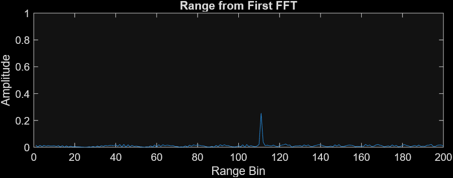
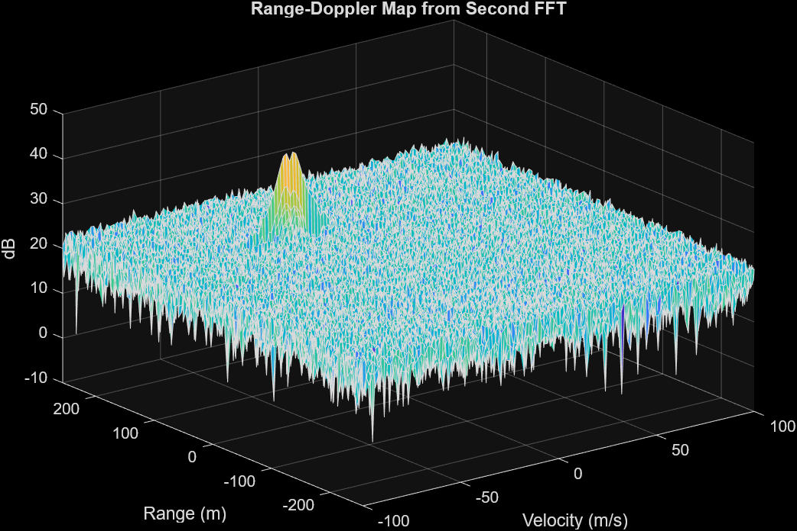
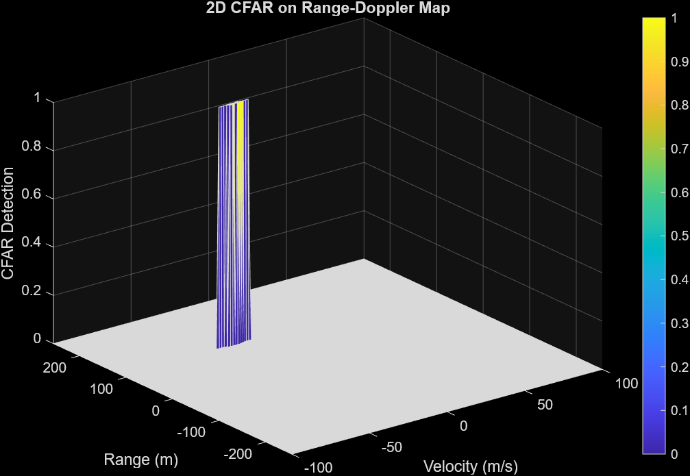

# FMCW Radar Target Detection using 2D FFT and CFAR

This project implements a radar signal processing pipeline using **FMCW (Frequency Modulated Continuous Wave)** techniques to detect a moving target's **range** and **velocity**. The final target detection is performed using a **Constant False Alarm Rate (CFAR)** filter applied on a **2D FFT Range-Doppler Map (RDM)**.

---

## 📌 Project Goals

1. **FMCW waveform generation**
2. **Signal generation and beat signal creation**
3. **Range FFT (1D FFT)**
4. **2D FFT for Range-Doppler Map (RDM)**
5. **2D CFAR to detect targets and suppress noise**

---

## Pipeline Overview

The radar signal processing pipeline follows these key steps:

1. **Signal Simulation:**
   - Define radar and target parameters.
   - Generate transmitted (Tx) and received (Rx) signals based on time delays.
   - Generate the beat signal by mixing Tx and Rx.

2. **Range Measurement (1D FFT):**
   - Reshape the beat signal.
   - Perform FFT on each chirp (row) to estimate range.
   - Plot single-sided amplitude spectrum.

3. **Range-Doppler Map (2D FFT):**
   - Reshape the beat signal.
   - Perform 2D FFT across range and doppler dimensions.
   - Apply logarithmic scaling for better visualization.

4. **CFAR Detection:**
   - Slide a training-guard cell window over the RDM.
   - Estimate noise level, compute threshold.
   - Detect peaks above threshold.
   - Generate binary detection map.

---

## 1. FMCW Waveform Design

The waveform is designed based on the following radar parameters:

| Parameter         | Value              |
|-------------------|--------------------|
| Max Range         | 200 m              |
| Range Resolution  | 1 m                |
| Max Velocity      | 100 m/s            |
| Carrier Frequency | 77 GHz             |

From these, the following parameters are calculated:

- **Bandwidth (B)**  
  \[
  B = \frac{c}{2 \times \text{Range Resolution}} = \frac{3 \times 10^8}{2 \times 1} = 150 \times 10^6 \text{ Hz}
  \]

- **Chirp Time (Tchirp)**  
  \[
  T_{\text{chirp}} = 5.5 \times \frac{2 \times \text{Max Range}}{c} = 5.5 \times \frac{400}{3 \times 10^8} \approx 7.33 \times 10^{-6} \text{ s}
  \]

- **Slope**  
  \[
  S = \frac{B}{T_{\text{chirp}}} \approx \frac{150 \times 10^6}{7.33 \times 10^{-6}} \approx 2.05 \times 10^{13} \text{ Hz/s}
  \]

✅ The calculated slope matches the rubric's expectation (~2e13 Hz/s).

---

## 2. Target Simulation & Beat Signal

The target's motion is simulated using:

- Initial Position: `R = 110 m`  
- Velocity: `v = -30 m/s` (approaching radar)

At each time step `t(i)`:
- Transmitted signal `Tx` and received signal `Rx` are generated.
- The **beat signal** is computed as:  
  \[
  \text{Mix}(i) = Tx(i) \times Rx(i)
  \]

---

## 3. Range FFT (1D FFT)

- Reshape `Mix` into `[Nr, Nd]` format.
- Apply FFT across range dimension.
- Normalize and keep one side of the FFT output.
- Plot shows a **clear peak at 110 m**, which matches the expected target location.

---

## 4. Range-Doppler Map (2D FFT)

- Apply 2D FFT on reshaped beat signal.
- Shift zero frequency to center.
- Plot shows strong energy peaks along target range and Doppler.

---

## 5. 2D CFAR Implementation

CFAR is applied on the RDM to detect valid targets and suppress noise.

### CFAR Parameters

| Parameter         | Value              |
|-------------------|--------------------|
| Training Cells    | Tr = 10, Tc = 8    |
| Guard Cells       | Gr = 4, Gc = 4     |
| CFAR Offset       | 6 dB               |

### CFAR Process

1. **Sliding Window:**  
   A loop slides across RDM while excluding boundary regions.  
   For each Cell Under Test (CUT), the surrounding training cells are used to estimate noise.

2. **Thresholding:**  
   - Convert training cell power from dB to linear.
   - Compute mean and convert back to dB.
   - Add offset → threshold.
   - Compare CUT with threshold.

3. **Suppression of Edges:**  
   Since edges can't be fully surrounded by training/guard cells, they are **zeroed out** to keep RDM size constant.

4. **Binary Output:**  
   RDM is converted to binary: 1 (detection), 0 (noise).

---

## ✅ Rubric Compliance Summary

| Rubric Section             | Implemented | Notes                                          |
|----------------------------|-------------|------------------------------------------------|
| FMCW Waveform Design       | ✅          | Correct slope calculated (~2e13 Hz/s)         |
| Simulation Loop            | ✅          | Accurate beat signal, range = 110 m           |
| 1D FFT (Range FFT)         | ✅          | Range peak clearly visible                    |
| 2D FFT (RDM)               | ✅          | Full RDM visualized                           |
| 2D CFAR                    | ✅          | Proper thresholding and noise suppression     |
| README CFAR Documentation  | ✅          | Training/Guard cells, offset, logic described |

---

## Conclusion

This project simulates a full radar signal processing chain and successfully demonstrates how FMCW radar can estimate range and velocity of a target, even in noisy conditions. The CFAR filtering ensures that only high-confidence detections are retained, greatly reducing false alarms.