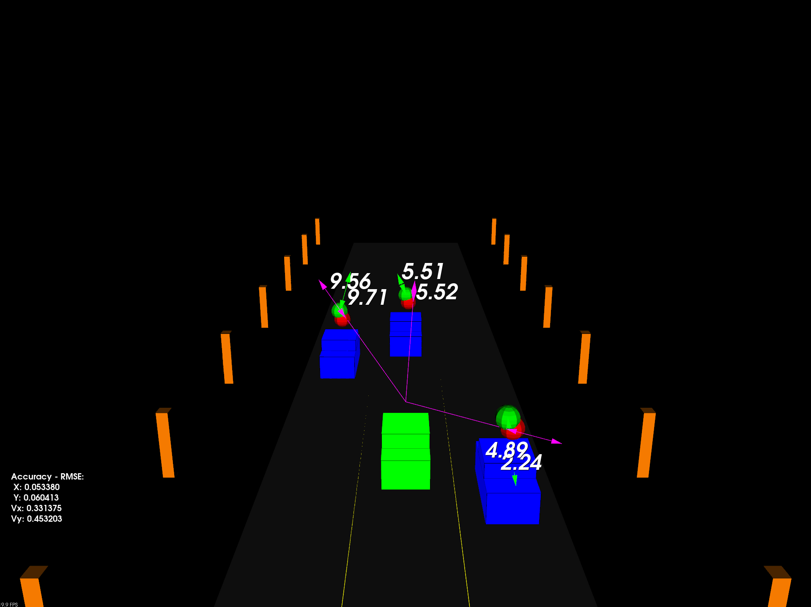

# SFND Unscented Kalman Filter Highway Tracker

This project implements an Unscented Kalman Filter (UKF) to fuse lidar and radar measurements while tracking multiple vehicles in a synthetic highway scenario. The simulation replays scripted maneuvers, feeds noisy sensor readings into the UKF, and visualises the resulting state estimates using the PCL visualiser.

## Project Highlights
- CTRV-motion UKF with configurable sensor usage (lidar, radar, or fusion).
- Tuned process noise and state initialisation for low-RMSE tracking.
- Automatic RMSE logging to `results/rmse_log.csv`, including a summary after each run.
- Optional future-path projection visualisation via the supplied tools.

## Requirements
- CMake 3.10+
- A C++17 compiler (tested with GCC/Clang)
- PCL 1.2+ and its dependencies (Eigen is bundled inside the project)
- OpenGL-capable environment (software rendering on WSL is fine)

## Build & Run
```bash
mkdir -p build
cd build
cmake ..
cmake --build .
./ukf_highway
```

The executable opens a window titled `3D Viewer`. Let it run for at least 10 seconds so that the accuracy overlay (RMSE) stabilises and the average RMSE is printed to the terminal.

## Configuration & Tuning
Key tuning parameters live in `src/ukf.cpp`:
- `std_a_` and `std_yawdd_` control process noise for longitudinal acceleration and yaw acceleration.
- The initial covariance matrix `P_` is tailored per sensor during the first measurement (`ProcessMeasurement`).
- Toggle lidar or radar usage by setting `use_laser_` / `use_radar_` in the `UKF` constructor.

The simulation scripts (vehicle trajectories, noise injection, RMSE display) reside in `src/highway.h` and `src/tools.cpp` if you want to experiment with motion profiles or measurement characteristics.

## Logging
- Per-frame RMSE (after 1 s of simulation time) is appended to `results/rmse_log.csv`.
- Once the run completes, an "Average RMSE" line is printed to the terminal and appended to the same CSV.
- The `results` directory is created automatically at runtime if it does not exist.

## Results


RMSE results are stored in `results/rmse_log.csv`.

## License
This repository is based on the Udacity Sensor Fusion Nanodegree starter code. Refer to Udacity's original licensing terms for reuse restrictions.
